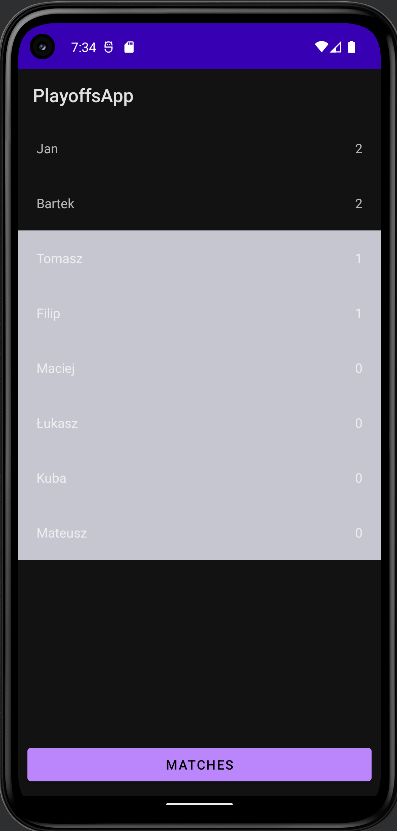
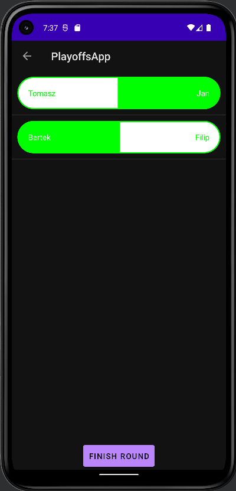

# PlayoffsApp
Mobile app for Android written in Java that is meant for referees of tournaments that are based on play-off system.
User can add contestants and their results as the competition goes on.
It uses Firebase to store data in realtime database.

